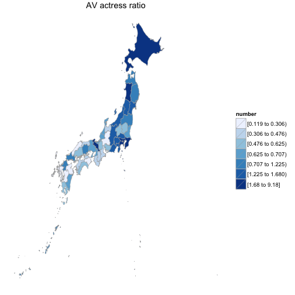

秋田美人のAV女優が多い...って本当?
====

## はじめに

[おぎやはぎのメガネびいきPodCast](https://itunes.apple.com/jp/podcast/junk-ogiyahaginomeganebiiki/id201596396?mt=2)を聴いていたところ, 

「秋田美人って本当かねー?」

「わかんないけど, タクシーの運ちゃん曰く, 秋田には綺麗なAV女優が多いらしいよ」

という話があったような気がします. 

真偽の程はともかく, AV女優の出身地分布は気になりますよね. 

データを用意することが出来たので, 調べてみました.

### AV女優のプロフィールデータ

[DMM.comのAV女優名鑑](http://actress.dmm.co.jp/-/detail/=/actress_id=11239/)には, 以下の情報が掲載されていました. 

* プロフィール
  * 生年月日
  
  * 星座
  
  * 血液型
  
  * スリーサイズとカップ数
  
  * 出身地

  * 趣味, 特技

出身地が書いてありましたので, これを使えば良さそうです. 

えいやっとクロールして, 整理してcsvデータにしてみました. 

## 準備

```r
library(data.table)
library(dplyr)

dat_av = fread("./av_actress_profile.dat")
dat_av = 
  dat_av %>% 
  mutate(birthday = as.Date(birthday, format="%Y年%m月%d日"))
## データの中身
dat_av %>% select(name, birthday, birthplace, blood) %>% head(2)
```

```
##          name   birthday birthplace blood
## 1:   愛あいり 1984-07-23     東京都     O
## 2: 藍色しあん 1991-10-21   神奈川県     A
```

```r
dat_av %>% dim
```

```
## [1] 9049    9
```

9049人分のAV女優のプロフィールデータです. 

## 出身地別AV女優人数

とりあえず出身地別AV女優人数を見ます.

```r
library(ggplot2)
dat_birthplace = dat_av %>% 
  filter(birthplace != "") %>% 
  group_by(birthplace) %>% 
  count(birthplace) %>% 
  arrange(desc(n))

dat_birthplace %>% 
  select(n) %>% sum
```

```
## [1] 2601
```

```r
dat_birthplace
```

```
## Source: local data table [81 x 2]
## 
##    birthplace    n
## 1      東京都 1221
## 2    神奈川県  377
## 3      北海道  105
## 4      千葉県  104
## 5      埼玉県   97
## 6      大阪府   56
## 7      静岡県   48
## 8      京都府   44
## 9      兵庫県   37
## 10     福岡県   36
## ..        ...  ...
```

2601人分の出身地データが有りましたが, 東京と神奈川で半分です. 


## 10万人あたりのAV女優人数ランキング(上位5県)

各都道府県の人口も考えないといけませんよね. 

[政府統計のe-stat](http://www.e-stat.go.jp/SG1/estat/eStatTopPortal.do)から, 国勢調査の結果データが得られました. 

2013年の都道府県別人口データを取得して, 10万人あたりのAV女優人数を見てみます. 

AV女優比率の上位5県を見てみましょう. 

```r
library(xtable)
## 県別統計データ(千人)
dat_pops = fread("./pops.csv", header=FALSE)
dat_pops %>% setnames(c("birthplace", "birthplace_yomi", "pops"))

dat_birthplace %>% 
  merge(dat_pops, by = "birthplace") %>% 
  mutate(av_ratio = n/pops * 100) %>% 
  select(birthplace, av_ratio) %>% 
  arrange(desc(av_ratio)) %>% 
  head(5) %>% 
  xtable() %>% print(type="html")
```

<!-- html table generated in R 3.1.3 by xtable 1.7-4 package -->
<!-- Tue Apr 28 06:03:32 2015 -->
<table border=1>
<tr> <th>  </th> <th> birthplace </th> <th> av_ratio </th>  </tr>
  <tr> <td align="right"> 1 </td> <td> 東京都 </td> <td align="right"> 9.18 </td> </tr>
  <tr> <td align="right"> 2 </td> <td> 神奈川県 </td> <td align="right"> 4.15 </td> </tr>
  <tr> <td align="right"> 3 </td> <td> 秋田県 </td> <td align="right"> 2.86 </td> </tr>
  <tr> <td align="right"> 4 </td> <td> 北海道 </td> <td align="right"> 1.93 </td> </tr>
  <tr> <td align="right"> 5 </td> <td> 京都府 </td> <td align="right"> 1.68 </td> </tr>
   </table>

10万人あたりAV女優人数でランキングにしてみました. 

1位は東京. さすがです. 10万人あたり9.18人. 

意外と秋田が多いですね. 10万人あたりで2.86人で, 3位です. 

秋田美人AV女優多い説, 結構正しかったです. 

## 10万人あたりのAV女優人数ランキング(下位5県)
ついでに, AV女優比率が低い5県も見てみます. 


```r
dat_birthplace %>% 
  merge(dat_pops, by = "birthplace") %>% 
  mutate(av_ratio = n/pops * 100) %>% 
  select(birthplace, av_ratio) %>% 
  arrange(desc(av_ratio)) %>% 
  tail(5) %>% 
  xtable() %>% print(type="html")
```

<!-- html table generated in R 3.1.3 by xtable 1.7-4 package -->
<!-- Tue Apr 28 06:03:32 2015 -->
<table border=1>
<tr> <th>  </th> <th> birthplace </th> <th> av_ratio </th>  </tr>
  <tr> <td align="right"> 1 </td> <td> 岐阜県 </td> <td align="right"> 0.20 </td> </tr>
  <tr> <td align="right"> 2 </td> <td> 大分県 </td> <td align="right"> 0.17 </td> </tr>
  <tr> <td align="right"> 3 </td> <td> 熊本県 </td> <td align="right"> 0.17 </td> </tr>
  <tr> <td align="right"> 4 </td> <td> 徳島県 </td> <td align="right"> 0.13 </td> </tr>
  <tr> <td align="right"> 5 </td> <td> 佐賀県 </td> <td align="right"> 0.12 </td> </tr>
   </table>

佐賀www


## まとめと展望


AV女優のプロフィールデータから, 都道府県別AV女優人数を調べました. 

10万人あたりのAV女優数で比較すると, 東京, 神奈川, 秋田がTop3でした. 

以上です. 

最後に, 今後やりたいことを載せます. 

他に何が出来ますかね?

* やりたいこと
  * 日本地図上に可視化してみる
  * カップ数も考えて集計
  * スリースタイルのデータで遊ぶ
  * 出演作品数も調べてみる
  * 出演作品のタグも拾ってみて, ジャンルも見る(ロリとか巨乳とか)


## 日本地図上で可視化(Choroplethrを使う)

大変ありがたいご指摘を頂きました. 

[Choroplethrを使って可視化すれば](http://rpubs.com/dichika/are_150426)いいみたいです. 


```r
library(choroplethr)
library(choroplethrAdmin1)

dat_av_ratio = 
  dat_birthplace %>% 
  merge(dat_pops, by = "birthplace") %>% 
  mutate(av_ratio = n/pops * 100) %>% 
  arrange(desc(av_ratio)) %>%
  mutate(region = tolower(birthplace_yomi)) %>% 
  mutate(value = av_ratio) %>% 
  select(region, value)

data("df_japan_census")

df_japan_census = 
  df_japan_census %>% 
  merge(dat_av_ratio, by = "region")

## 可視化
admin1_choropleth(country.name = "japan",
                  df = df_japan_census, 
                  title = "AV actress ratio", 
                  legend = "number")
```

```
## Warning in self$bind(): The following regions were missing and are being
## set to NA: NA
```

 

これはかっこいいですね! 


